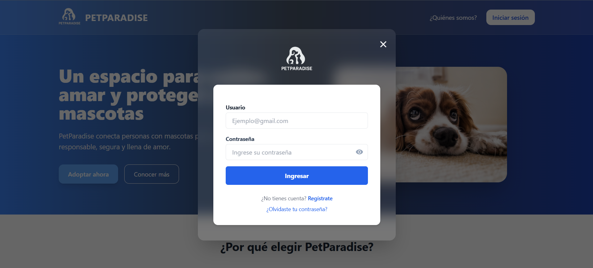
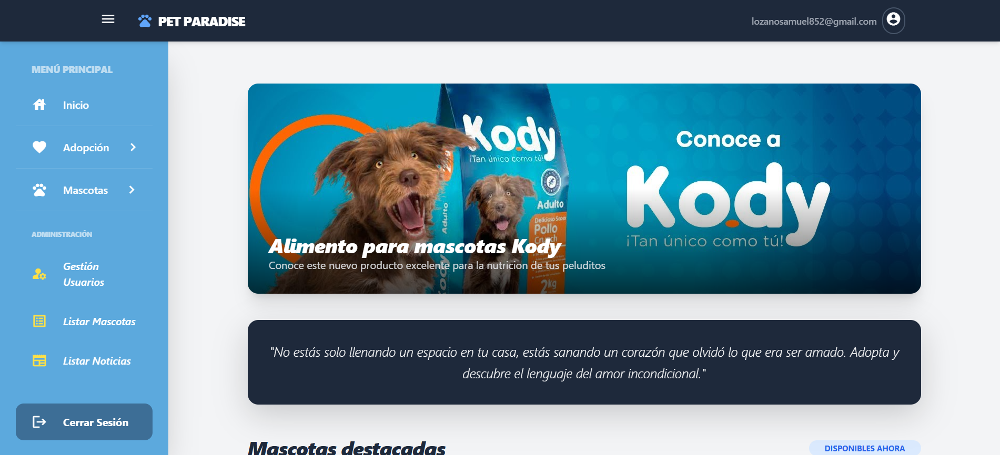

# 🐾 PetParadise

PetParadise is a web platform developed with ASP.NET Core that facilitates responsible pet adoption. It allows users to manage animals, users, and adoption processes efficiently, integrating modern services and best development practices.

---

## 🚀 Features

* 🐶 Pet registration and management
* 👤 User management
* 📋 Adoption process handling
* ☁️ Integration with Azure Storage
* 🧪 Unit testing implemented
* 🏗️ Layered architecture (Controllers, Services, Models)

---

## 🛠️ Technologies

* ASP.NET Core
* Entity Framework Core
* SQL Server
* Azure Storage
* xUnit

---

## 📸 Screenshots

### 🔐 Login



### 📊 Dashboard



---

## ⚙️ Project Setup

Before running the project, you need to configure the `appsettings.json` file.

### 🔐 Database Connection

Add your SQL Server connection string:

```json
"ConnectionStrings": {
  "servidor": "your_sql_server_connection",
  "AzureStorage": "your_azure_storage_connection"
}
```

---

## ▶️ How to Run

1. Clone the repository
2. Open the solution in Visual Studio
3. Configure `appsettings.json`
4. Run the project

---

## 🧪 Running Tests

To execute unit tests:

* Open Test Explorer in Visual Studio
* Run all tests

---

## 🌐 Live Demo

👉 https://petparadise-h3gtbxfde8cvezcs.mexicocentral-01.azurewebsites.net/

---

## 👨‍💻 Author

Developed by Alejandro

---

## 📌 Notes

This project follows clean architecture principles and demonstrates best practices in backend development, testing, and cloud integration.
